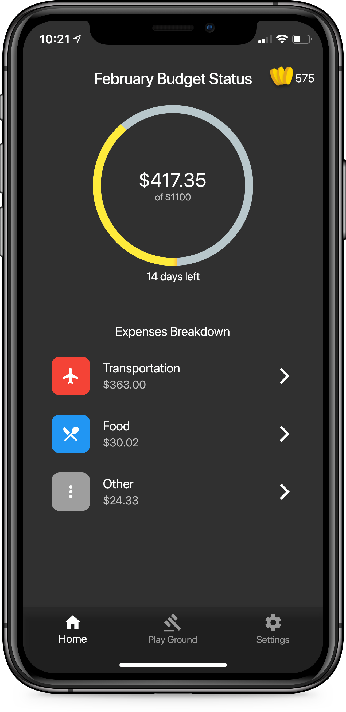
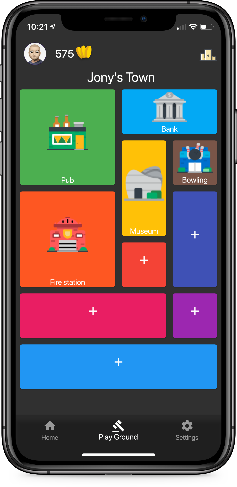
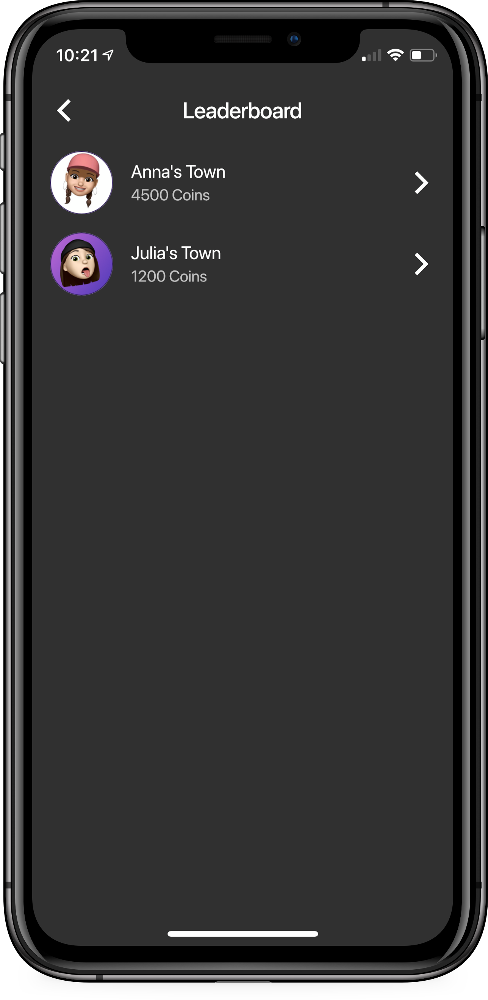

# BudgetTown

## Demo

          

Stay on your budget. Receive Virtual Coins. Spend them on building your town. See how your friends are doing with their town.

## Inspiration

It's human nature to expect the best and not plan for the worst, so many otherwise smart Americans refuse to budget–because they don't think they need it. Then a serious illness or accident keeps them out of work. Or they simply get laid off. While some mobile applications in the market help with budgeting, they all share two main problems: 1. The app gets complicated to use, 2. People stop keeping track of their budget because of the lack of motivation and education.

Also, we wanted people to use their banking apps more often, and enjoy their time when dealing with their budgeting. However, as the CEO of Envel said, no one goes home at the end of the day to check their banking app or financial status.

During the hackharvard, we tried to solve this issue, by introducing Budget Town due to our gamified budgeting technique. We looked for a way to motivate and educate users on their budgeting while keeping everything entertaining for them, instead of using classic methods.

## What it does

Budget Town allows users to enter their banking status and connect to their bank account. Then, the users can set their budget goals for the month, and keep track of their expenses. Budget Town provides the user with categorized expenses and specific budgeting by category. Budget Town rewards its users with Virtual Coins that are only valid inside the app and can be used for developing their Virtual City.

For **example**, Anna put his budget on \$1, 200

for September, and she only spent \$700 on her budget. Thus, the app would reward her **580** Virtual Town Coins. Then, she can use this to build her Virtual City. She can also look at her friend's, John, town and see how is John building his town, and how did he design it.

Every day that users spend within the budget, they gain partial coins. If they spend more than their budget, they won’t receive any coins for that day, putting them behind other competitors.

Furthermore, users can use the app leaderboard system which has two filters to it, one which is Global and the other with their Social Friends which they can gain by connecting their social media to it, like Facebook OAuth. This will provide a more motivational environment which will help them to be more stable in their financial status.

The users can then use their coins to purchase structures to build their cities like houses, buildings, and restaurants. These cities can then be viewed by their social friends, and by others around the world if you’re in the global leaderboard. The leaderboard is based on the number of trophies you have which is calculated by the number of structures you have in your city based on a scoring system.

## How we built it

We designed almost every part of the in Sketch, and we built the app to be available cross-platform using Flutter and Dart.

## Challenges we ran into

Designing the city was challenging since we had to design every single building and the layout. Also, it was the first time using Flutter for us, so it was a steep learning experience. We glad that we got it all working. :)

## Accomplishments that we're proud of

We were able to create a functional mobile application that is available both on Android and iOS. We were able to achieve our goal of "gamifying" the budget planning experience. Also, we did our best to make the app as simple as possible by having a simple and beautiful UI and UX.

## What we learned

Designing in Sketch. Dart and Flutter and the overall gist of mobile development. Using Flare for 3D animation.

## What's next for Budget Town

### Work with banks

Partnering with banks can be beneficial to them in many ways. Budget Town is not a classic simple budget planning app, it is entertaining and easy to use, notably by the college students. We can partner with banks like Capital One, and make the app only work with their customers. This way, it is a wonderful advertisement for Capital One and a great competitive edge for them. Also, customers may rather to only use their Capital One accounts to be able to use the app and continue developing their cities.

### Work with envel

The other example can be even. Users can log in, like OAuth., using their envel accounts. Then, they do not have to connect any bank accounts anymore! Budget Town would just get the data from envel, and use those data to reward the users on their positive financial habits, like staying within their budget. Then the users can use those rewards to play the game and continue developing their cities. Also, it is a great source of advertising for envel since it has a social aspect in it that users can see their friends city and see their progress.

Furtheremore, we can make the app more immersive and captivating by creating an Augmented Reality for it which allows them to view their progress and their city in a much more different perspective. Eventually, users can use the Virtual Coins to purchase more land and expand their city and use their imagination and their budgeting to design a beautiful city.
